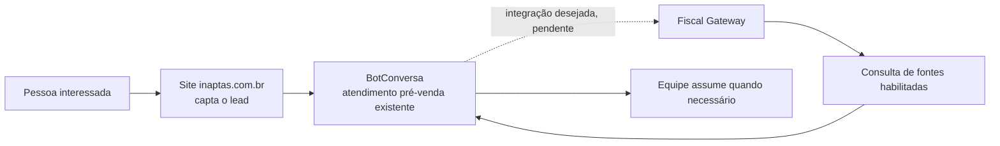
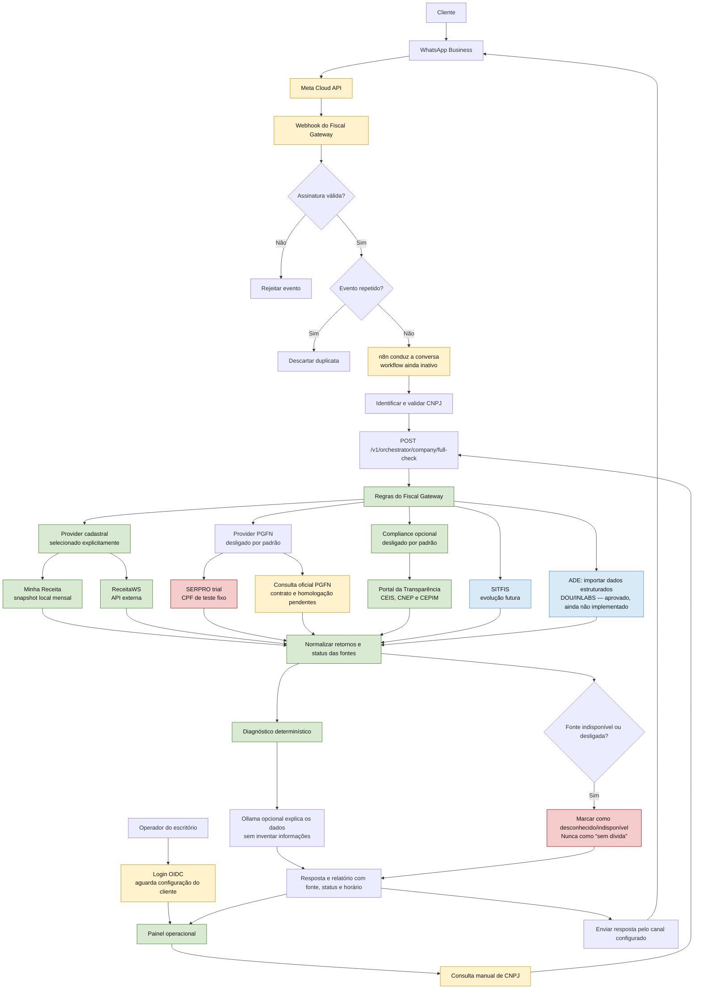

# Fluxograma do Sistema Inaptas

**Atualizado em:** 08/10/2026
**Objetivo:** mostrar o caminho da consulta do início ao fim e deixar visível o que já existe, o que ainda depende de acesso externo e o que é evolução futura.

## Em uma frase

O cliente chega pelo site ou pelo atendimento, informa um CNPJ, e o Fiscal Gateway consulta apenas as fontes habilitadas. O sistema organiza os retornos e explica o que foi confirmado. Se uma fonte falhar, diz que não conseguiu consultar.

## Jornada comercial relatada pelo cliente

No áudio de 19/08, o cliente descreve o site `inaptas.com.br` como origem dos
leads e o BotConversa como ferramenta já usada no atendimento de pré-venda. A
ideia é adicionar consultas e IA para ajudar nesse atendimento e encaminhar os
casos que precisam de uma pessoa. Essa integração ainda não existe no código e
precisa ser detalhada e homologada.

## Fluxo previsto no código atual

O diagrama abaixo representa o caminho que o repositório implementa para
Meta/WhatsApp + n8n e para o painel. O workflow n8n está inativo e os serviços
externos ainda precisam de homologação. BotConversa e o site não estão ligados
ao Gateway neste momento.

## Como ler as cores

- **Verde:** capacidade implementada no código. Isso não significa que a conta externa esteja configurada ou homologada.
- **Amarelo:** depende de conta, domínio, credencial, contrato ou homologação externa.
- **Azul:** planejado para uma fase posterior.
- **Vermelho:** cuidado especial. O trial PGFN consulta um documento de teste fixo e **não consulta o CNPJ enviado pelo usuário**.

## Regras que valem em todos os caminhos

1. `source_data` registra o que veio da fonte; `system_diagnosis` aplica regras determinísticas; `ai_interpretation` apenas explica o resultado.
2. Um provider desativado, uma falha ou uma resposta incompleta significa **desconhecido**, nunca “regular” ou “sem dívida”.
3. Minha Receita e ReceitaWS são escolhidos por configuração. Não existe troca automática silenciosa entre elas.
4. O provider `serpro_trial` fica desativado por padrão e serve somente para homologação. Nunca habilite esse trial como consulta real de empresas.
5. CEIS/CNEP/CEPIM são registros de sanções e impedimentos; não são PGFN, CND nem prova de regularidade fiscal.
6. SITFIS exige contrato, e-CNPJ e autorização/procuração quando aplicável. Para ADE, a direção aprovada é consumir dados estruturados do DOU/INLABS. CAPTCHA não será contornado.

## Estado de execução

O Gateway e o painel existem no repositório. O workflow do n8n está exportado, mas ainda inativo. A entrada Meta/WhatsApp, o login OIDC, os providers pagos e a consulta oficial SERPRO/PGFN precisam de configuração e homologação do cliente antes da produção. A [matriz de acessos](ACESSOS.md) mostra cada pendência.
